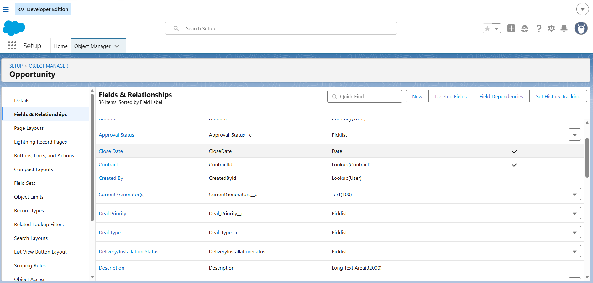
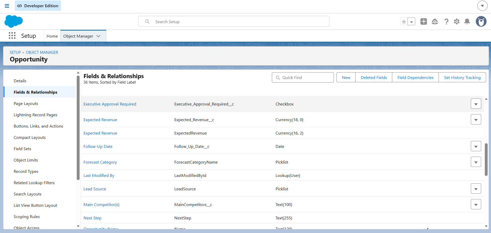
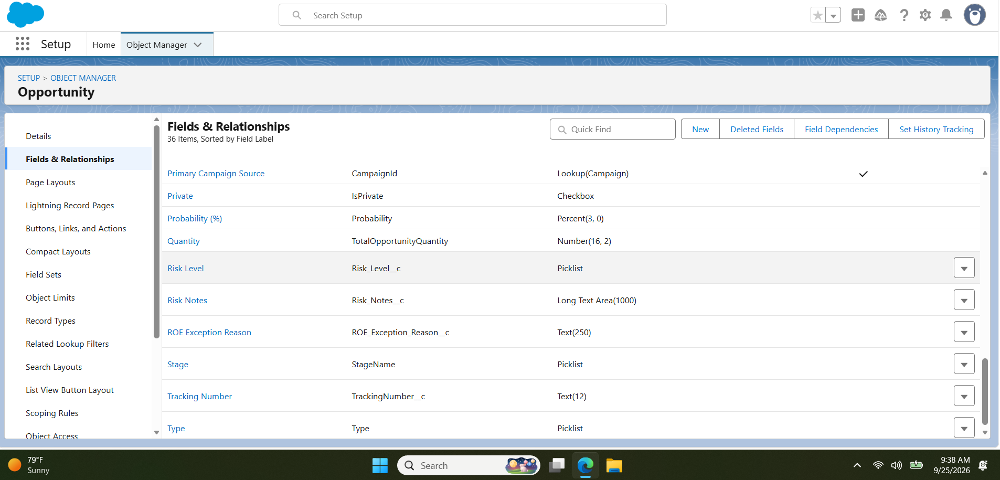
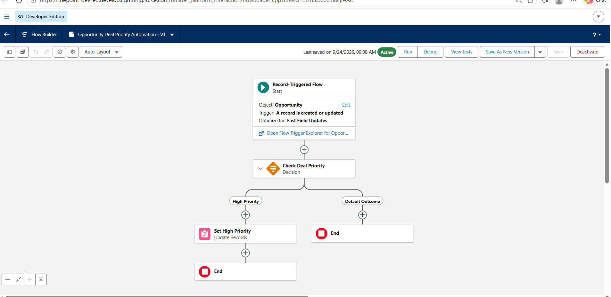
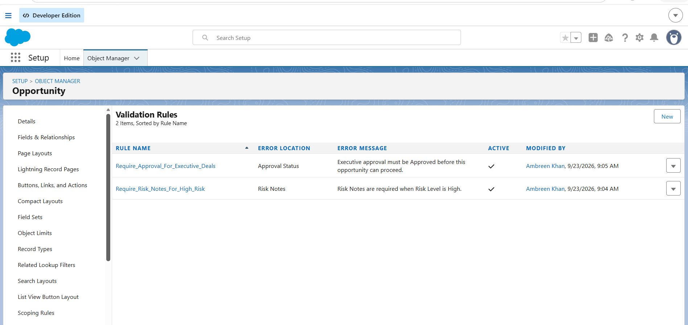
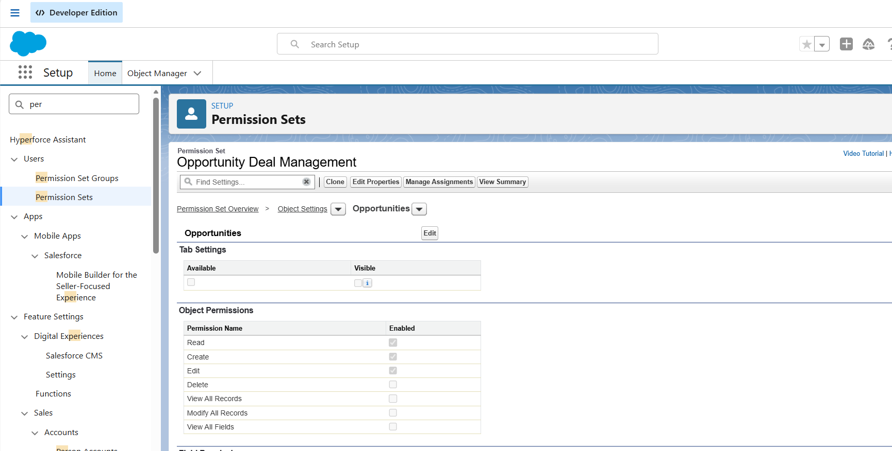
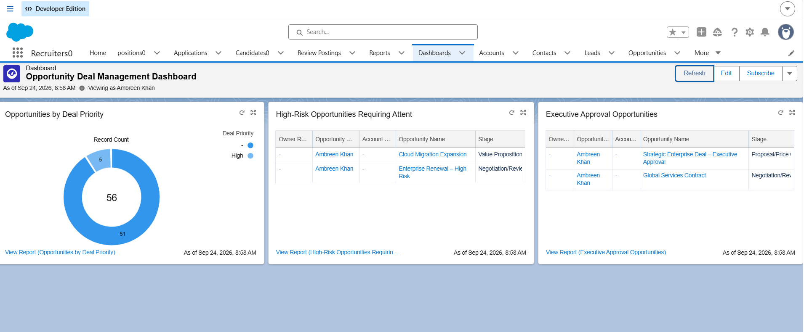

# Salesforce Opportunity Deal Management

## Project Overview

This Salesforce Admin project demonstrates an Opportunity Deal Management solution designed to help sales teams prioritize opportunities, identify high-risk deals, enforce executive approval requirements, and provide management visibility through reports and dashboards.

The solution was built using Salesforce declarative tools with a focus on automation, data quality, security, and reporting.

## Business Requirements

The sales team needed a solution to:

- Prioritize important sales opportunities.
- Identify and track high-risk deals.
- Require additional information for high-risk opportunities.
- Enforce executive approval requirements.
- Automate updates for high-priority opportunities.
- Provide managers with visibility into deal priority, risk, and approvals.
- Control user access using Salesforce security features.

## Salesforce Features Used

- Custom Opportunity Fields
- Record-Triggered Flow
- Decision Elements
- Update Records
- Validation Rules
- Permission Sets
- Object and Field-Level Security
- Reports
- Dashboard
- Flow Debugging and Testing

## Custom Fields

Custom fields were added to the Opportunity object to support the business process, including:

- Deal Priority
- Risk Level
- Risk Notes
- Executive Approval Required
- Approval Status
- Follow-Up Date

## Flow Automation

A Record-Triggered Flow named **Opportunity Deal Priority Automation** was created for the Opportunity object.

The Flow:

1. Runs when an Opportunity is created or updated.
2. Evaluates the Opportunity's Deal Priority.
3. Uses a Decision element to identify High Priority opportunities.
4. Routes qualifying records through the High Priority path.
5. Uses an Update Records element to perform the required Opportunity update.

The Flow was debugged, tested, and activated successfully.

## Validation Rules

Two validation rules were implemented to improve data quality and enforce business requirements.

### Require Risk Notes for High Risk

When an Opportunity has a **High Risk Level**, the user must provide Risk Notes before the record can be saved.

### Require Approval for Executive Deals

When **Executive Approval Required** is selected, the appropriate approval status must be completed before the Opportunity can proceed.

Both validation rules were tested successfully.

## Security and Access

A custom Permission Set named **Opportunity Deal Management** was created.

Opportunity object permissions were configured using a least-privilege approach, including:

- Read
- Create
- Edit

Access to project-specific Opportunity fields was also configured through field permissions.

## Reports

The following reports were created:

1. **Opportunities by Deal Priority**
2. **High-Risk Opportunities Requiring Attention**
3. **Executive Approval Opportunities**

These reports provide sales managers with visibility into important deals, risk, and approval requirements.

## Dashboard

An **Opportunity Deal Management Dashboard** was created using the project reports.

The dashboard includes:

- Opportunities by Deal Priority
- High-Risk Opportunities Requiring Attention
- Executive Approval Opportunities

This provides managers with a centralized view of opportunity priority, risk, and approval activity.

## Testing

The solution was tested using multiple Opportunity records and scenarios.

Testing included:

- High Priority Opportunity Flow execution
- High Risk Opportunity validation
- Executive Approval validation
- Report filtering
- Dashboard data visibility
- Permission Set access

## Skills Demonstrated

Salesforce Administration | Flow Builder | Record-Triggered Flows | Validation Rules | Permission Sets | Field-Level Security | Opportunity Management | Reports | Dashboards | Data Quality | Testing & Debugging

## Project Type

## Key Takeaways

This project demonstrates hands-on Salesforce Administrator experience in:

- Opportunity management and customization
- Record-Triggered Flow automation
- Validation rules and data quality
- Permission Sets and field-level security
- Reports and dashboards
- Business process automation
- Testing and troubleshooting

The solution was designed using Salesforce declarative and low-code capabilities following administrator best practices.

**Salesforce Administrator Portfolio Project**

This project was built using Salesforce declarative and low-code capabilities without Apex or Lightning Web Components.
